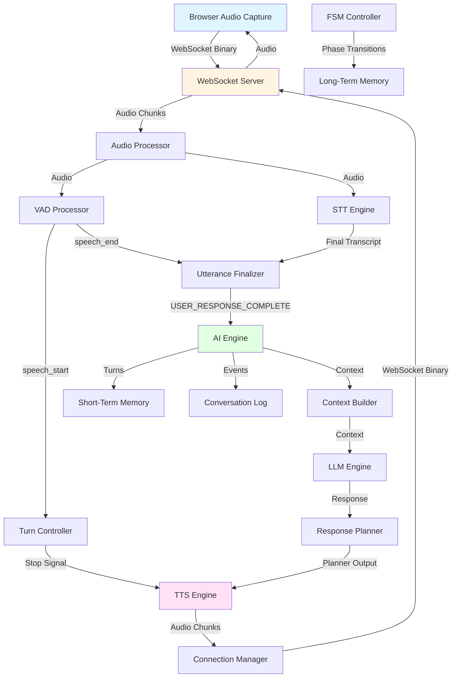

# End-to-End User Flow Documentation

## Overview

This document describes the complete end-to-end flow of a user turn in the AI interview system, from when the user speaks to when they receive the assistant's audio response.

## Complete Flow Diagram



## Step-by-Step Flow Description

### 1. User Speaks → Browser Captures Audio

**Location**: Browser (client-side)

**Description**: 
- Browser captures audio from microphone
- Audio is captured in 20ms chunks (640 bytes at 16kHz, 16-bit PCM)
- Audio is sent immediately via WebSocket binary frames

**Format**: 16-bit PCM, little-endian, 16kHz, mono

### 2. Audio → WebSocket → Audio Processor

**Files**: 
- `routes/websocket_routes.py` - `handle_audio_chunk()`
- `core/audio/audio_processor.py` - `process_audio_chunk()`

**Description**:
- WebSocket receives binary frame
- Routes to `handle_audio_chunk()` function
- Gets or creates `AudioProcessor` for session
- Calls `audio_processor.process_audio_chunk(audio_data)`

**Error Handling**:
- Errors logged with context (session_id, chunk_size)
- Non-critical errors don't block processing
- Connection errors handled gracefully

**Logging**:
- Logs chunk reception with size and timestamp
- Logs processing duration

### 3. VAD Detects speech_start → Stops TTS

**Files**:
- `core/audio/vad_processor.py` - `process_chunk()`, `_update_state()`
- `core/audio/turn_controller.py` - `handle_speech_start()`
- `core/tts/tts_engine.py` - `stop()`

**Description**:
- VAD processes audio chunks in background thread
- When speech probability exceeds threshold for minimum duration:
  - Emits `SPEECH_START` event
  - Event routed to `TurnController`
  - `TurnController` calls TTS stop callback
  - TTS immediately stops streaming

**Error Handling**:
- VAD errors use fallback heuristics (audio energy)
- TTS stop errors are logged but don't crash
- Pipeline continues even if VAD fails

**Logging**:
- Logs speech probability and state transitions
- Logs TTS interruption with duration

### 4. VAD Detects speech_end → Triggers Finalization

**Files**:
- `core/audio/vad_processor.py` - `_update_state()`
- `core/audio/utterance_finalizer.py` - `handle_vad_event()`

**Description**:
- VAD detects silence threshold for minimum duration
- Emits `SPEECH_END` event
- Event routed to `UtteranceFinalizer`
- Finalizer starts timeout timer (default: 3000ms)
- Waits for STT final transcript

**Error Handling**:
- Timeout errors handled gracefully
- Empty transcript allowed if STT fails
- Finalization continues even with errors

**Logging**:
- Logs speech_end detection
- Logs timeout events
- Logs finalization delay from speech_end

### 5. STT Processes → Final Transcript

**Files**:
- `core/stt/stt_engine.py` - `send_audio()`, `_on_message()`
- `core/audio/utterance_finalizer.py` - `handle_stt_final_transcript()`

**Description**:
- STT receives audio chunks (80ms chunks for optimal performance)
- Deepgram Flux processes audio stream
- Final transcript received via `EndOfTurn` event or timeout
- Transcript sent to `UtteranceFinalizer`

**Error Handling**:
- Connection failures handled with retry logic
- Timeout handling (5s for connection, 2s for final transcript)
- Flow continues even if STT fails (empty transcript)

**Logging**:
- Logs transcript reception (final vs partial)
- Logs STT connection status
- Logs transcript length and content

### 6. Utterance Finalizer → USER_RESPONSE_COMPLETE

**Files**:
- `core/audio/utterance_finalizer.py` - `_check_finalization()`

**Description**:
- Finalizer checks both conditions:
  1. VAD `speech_end` received
  2. STT final transcript available (even if empty)
- When both met, calls completion callback
- Callback triggers AI Engine processing

**Error Handling**:
- Timeout errors: finalize with empty transcript
- Callback errors: logged, state reset for retry
- 30s timeout on callback execution

**Logging**:
- Logs finalization completion
- Logs delay from speech_end to finalization
- Logs callback execution duration

### 7. AI Engine Processes

**Files**:
- `core/ai/ai_engine.py` - `process_user_response()`

**Sub-steps**:

#### 7A. FSM Checks Phase
- Gets current interview phase from session
- Validates phase state
- Fallback: GREETING if phase check fails

#### 7B. Context Builder Builds Context
- Retrieves recent turns from short-term memory (or session.turn_history)
- Gets current question, phase, follow-up count
- Formats context for LLM
- Fallback: Minimal context if building fails

#### 7C. LLM Called
- Sends formatted context + user utterance to LLM
- Receives structured JSON response
- Validates response structure
- Fallback: ACKNOWLEDGE action if LLM fails

#### 7D. Response Planner Validates
- Validates LLM response structure
- Checks FSM rules (action allowed in phase)
- Checks limits (max follow-ups)
- Applies question limits
- Generates speakable text
- Handles phase transitions
- Updates session state

**Error Handling**:
- Each step has try-except with fallbacks
- Always returns valid `PlannerOutput`
- Errors logged at each step
- Fallback responses generated

**Logging**:
- Logs each step completion with timing
- Logs LLM inputs/outputs
- Logs planner decisions
- Logs turn creation

### 8. TTS Generates Audio

**Files**:
- `core/tts/tts_engine.py` - `speak()`, `_stream_audio()`
- `core/audio/audio_processor.py` - AI completion callback

**Description**:
- Receives planner output text
- Checks if type is SPEAK
- Calls Cartesia API for streaming TTS
- Streams audio chunks immediately
- Sends chunks to ConnectionManager
- Handles interruptions (user speech)

**Error Handling**:
- Retry logic for transient API errors (2 retries, exponential backoff)
- Connection failures handled gracefully
- TTS errors don't block flow (logged only)

**Logging**:
- Logs TTS start with text length
- Logs streaming progress (chunk counts)
- Logs interruptions with duration
- Logs TTS stop events

### 9. Audio → WebSocket → Browser

**Files**:
- `core/connection_manager.py` - `send_audio_chunk()`
- `routes/websocket_routes.py` - WebSocket endpoint

**Description**:
- ConnectionManager routes audio chunks to WebSocket
- WebSocket sends binary frames to browser
- Browser plays audio immediately

**Error Handling**:
- Connection errors detected
- Failed sends logged
- TTS stops if connection lost

**Logging**:
- Logs audio chunk sends
- Logs connection status

### 10. Memory Updated (Async)

**Files**:
- `core/memory/memory_manager.py`
- Various components (AI Engine, FSM Controller, etc.)

**Description**:
- Short-term memory: Turn added after completion (fire-and-forget)
- Conversation log: Events logged throughout (fire-and-forget)
- Long-term memory: Phase summaries triggered on transitions (background task)

**Error Handling**:
- Memory operations are non-blocking
- Errors logged but don't affect main flow
- Memory failures don't crash session

**Logging**:
- Logs memory updates
- Logs phase summary triggers

## Initial Greeting Flow

**Special Case**: When session is first created

1. WebSocket connects → Session created
2. `ai_engine.start_interview()` called
3. AI Engine generates greeting (same steps as 7A-7D)
4. Greeting sent as control message
5. **NEW**: Greeting also sent through TTS
6. User hears greeting and can respond

## Error Handling Points

### Critical Path (Must Not Fail)
- WebSocket connection
- Audio processor routing
- AI Engine processing (with fallbacks)
- TTS generation (with retry)

### Non-Critical (Can Fail Gracefully)
- VAD processing (fallback heuristics)
- STT processing (empty transcript fallback)
- Memory operations (fire-and-forget)
- Logging (non-blocking)

### Error Recovery Strategies
1. **Retry Logic**: TTS API, STT connection
2. **Fallbacks**: VAD heuristics, minimal context, default responses
3. **Graceful Degradation**: Continue without failed components
4. **Timeout Handling**: Prevent hanging operations

## Logging Points

### Flow Step Markers
- `[TIMING]` prefix for timing-critical logs
- `[TRACE:ID]` prefix for flow tracing
- Duration logged in milliseconds

### Key Logging Points
1. Audio chunk reception (size, timestamp)
2. VAD events (speech_start, speech_end, probability)
3. STT transcripts (final, partial, length)
4. Utterance finalization (delay from speech_end)
5. AI processing steps (each step timing)
6. TTS events (start, stop, interruptions, chunk counts)
7. Memory updates (turns, logs, summaries)

## Flow Tracing

**Trace ID Generation**:
- Generated when utterance is finalized
- 8-character UUID prefix
- Logged with `[TRACE:ID]` prefix at each step
- Enables end-to-end debugging

**Trace ID Propagation**:
- Generated in `UtteranceFinalizer` callback
- Logged in AI Engine processing
- Logged in TTS generation
- Can be extended to other components

## Common Issues and Solutions

### Issue: TTS Not Speaking
**Symptoms**: No audio output
**Debugging**:
1. Check logs for TTS start events
2. Verify planner output type is SPEAK
3. Check TTS engine creation
4. Verify ConnectionManager is sending chunks

### Issue: User Speech Not Detected
**Symptoms**: No response to user speech
**Debugging**:
1. Check VAD events in logs
2. Verify audio format (16kHz, 16-bit PCM)
3. Check VAD thresholds
4. Verify STT is receiving audio

### Issue: AI Processing Slow
**Symptoms**: Long delay before response
**Debugging**:
1. Check `[TIMING]` logs for each step
2. Identify slow step (LLM, context building, etc.)
3. Check for errors or retries
4. Verify memory operations are non-blocking

### Issue: Interruptions Not Working
**Symptoms**: TTS continues when user speaks
**Debugging**:
1. Check VAD speech_start events
2. Verify TurnController receives events
3. Check TTS stop callback registration
4. Verify TTS stop() is being called

## Performance Metrics

### Expected Timings
- Audio chunk processing: < 5ms
- VAD processing: ~100ms (background thread)
- STT finalization: 500-3000ms (depends on speech length)
- AI processing: 1-5s (LLM call is main bottleneck)
- TTS start: < 100ms
- TTS streaming: Real-time (chunks sent immediately)

### Optimization Notes
- VAD runs in thread pool (non-blocking)
- STT buffers to 80ms chunks (optimal for Deepgram)
- Memory operations are fire-and-forget
- TTS streams immediately (no buffering)

## Testing Scenarios

### Happy Path
1. User speaks → Response generated → TTS speaks
2. Verify all steps complete
3. Check timing logs
4. Verify memory updates

### Initial Greeting
1. Connect WebSocket
2. Verify greeting is spoken via TTS
3. Verify greeting appears in control message

### Interruption
1. Start TTS speaking
2. User speaks during TTS
3. Verify TTS stops immediately
4. Verify user speech is processed

### Error Recovery
1. Simulate component failure (VAD, STT, LLM, TTS)
2. Verify system continues gracefully
3. Verify fallback responses generated
4. Check error logs

### Multiple Turns
1. Complete multiple Q&A cycles
2. Verify turn history updates
3. Verify context includes recent turns
4. Verify phase transitions work

## Flow Trace Example

```
[TRACE:a1b2c3d4] AI Engine Triggered for session abc123 with transcript: 'Hello'
[TRACE:a1b2c3d4] Processing user response through AI engine
[TIMING] Processing user response for session abc123, utterance_length=5 chars
[TRACE:a1b2c3d4] AI engine processing complete: action=next_question, type=speak
[TRACE:a1b2c3d4] Sending to TTS: text_length=45
[TRACE:a1b2c3d4] TTS started for session abc123: text_length=45, start_duration=23.45ms
[TIMING] User response processed for session abc123: action=next_question, type=speak, total_time=2.34s
```

## Notes

- All timing logs use `[TIMING]` prefix for easy filtering
- Flow trace IDs use `[TRACE:ID]` prefix
- Error handling is comprehensive but graceful
- Memory operations never block the main flow
- Initial greeting now uses TTS (not just control message)
